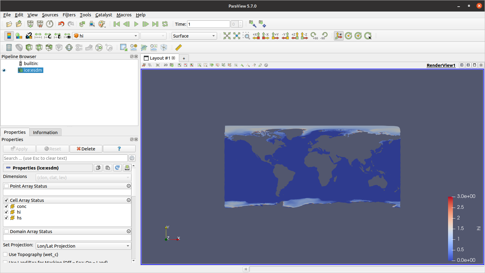

-   [Earth System Data Middleware](#earth-system-data-middleware)
-   [Data Model](#data-model)
    -   [Conceptual Data Model](#conceptual-data-model)
    -   [Logical Data Model](#logical-data-model)
-   [Supported data backends](#supported-data-backends)
    -   [DDN Web Object Scaler (WOS)](#ddn-web-object-scaler-wos)
    -   [Seagate Motr (MOTR)](#seagate-motr-motr)
    -   [DDN Infinite Memory Engine
        (IME)](#ddn-infinite-memory-engine-ime)
    -   [Portable Operating System Interface
        (POSIX)](#portable-operating-system-interface-posix)
    -   [Kove Direct System Architecture
        (KDSA)](#kove-direct-system-architecture-kdsa)
    -   [Amazon Simple Storage Service
        (S3)](#amazon-simple-storage-service-s3)
-   [Documentation](#documentation)
    -   [PDF](#pdf)
    -   [HTML and PDF with
        API-Reference](#html-and-pdf-with-api-reference)
    -   [Github-Markdown](#github-markdown)
-   [Building instructions](#installation-instructions-for-mistral)
    -   [Dependencies (Spack)](#satisfying-requirements)
    -   [ESDM prototype](#esdm-prototype)
    -   [HDF5](#hdf5)
    -   [ESDM-NetCDF and
        ESDM-NetCDF-Python](#esdm-netcdf-and-esdm-netcdf-python)
    -   [Docker](#docker)
-   [Configuration](#configuration)
    -   [File Format](#file-format)
    -   [Data Parameters](#data-parameters)
    -   [Metadata Parameters](#metadata-parameters)
-   [Usage](#sec:usage-examples:esdm-usage)
    -   [NetCDF](#sec:usage-examples:netcdf)
    -   [CDO](#sec:usage-examples:cdo)
    -   [XIOS](#sec:usage-examples:xios)
    -   [Python](#sec:usage-examples:python)
    -   [Dask](#sec:usage-examples:dask)
    -   [NetCDF-Bench](#netcdf-bench)
    -   [Paraview](#paraview)
-   [Developers guide](#developers-guide)
    -   [Internal Data Model](#internal-data-model)
    -   [Usage Examples](#sec:user-guides:usage-example)
-   [Use Cases](#use-cases)
    -   [ Workloads in climate and
        weather](#workloads-in-climate-and-weather)
    -   [Stakeholders and Systems](#stakeholders-and-systems)
    -   [List of Use-Cases](#list-of-use-cases)
-   [Styleguide for ESDM development](#styleguide-for-esdm-development)
    -   [General rules](#general-rules)
    -   [Naming conventions](#naming-conventions)
    -   [Example Code](#example-code)
-   [Callgraph for accessing
    metadata](#callgraph-for-accessing-metadata)
    -   [General responsibility](#general-responsibility)
    -   [Write](#write)
    -   [Read](#read)
-   [Grid deduplication](#grid-deduplication)
    -   [Requirements](#requirements)
    -   [Implementation](#implementation)
    -   [Roadmap for Implementation](#roadmap-for-implementation)
-   [Related Work](#related-work)

# Earth System Data Middleware

The middleware for earth system data is a prototype to improve I/O
performance for earth system simulation as used in climate and weather
applications. ESDM exploits structural information exposed by workflows,
applications as well as data description formats such as HDF5 and NetCDF
to more efficiently organize metadata and data across a variety of
storage backends.

# Data Model

While datatypes introduced by computer architectures and software
libraries are important for the data model, they are discussed
separately in .

The data model of a system organizes elements of data, standardizes how
they represent data entities and how users can interact with the data.
The **model** can be split into three layers:

-   The **conceptual data** model describes the entities and the
    semantics of the domain that are represented by the data model and
    the typical operations to manipulate the data. In our case, the
    scientific domain is NWP/climate.

-   The **logical data model** describes the abstraction level provided
    by the system, how domain entities are mapped to objects provided by
    the system[1], and the supported operations to access and manipulate
    these objects are defined. Importantly, the **logical data model**
    defines the semantics when using the operations to access and
    manipulate the system objects. For example, a system object of a
    relational model is a table – representing attributes of a set of
    objects – and a row of a table representing attributes of a single
    object.

-   The physical data model describes how the logical entities are
    finally mapped to objects/files/regions on available hardware. The
    physical data model is partly covered by the backends of ESDM,
    therefore, the descriptions will stop at that abstraction level.

## Conceptual Data Model

Our conceptual data model is aligned with the needs of domain scientists
from climate and weather. It reuses and extends from concepts introduced
in a data model proposed for the Climate and Forecasting conventions for
NetCDF data.

#### Variable:

A variable, *V*, defines a set of data representing a discrete
(generally scalar) quantity discretised within a “sampling” domain, *d*.
It is accompanied by

#### Metadata:

Which will include at the minimum, a name, but may also include units,
and information about additional dimensionality, directly (e.g. via a
key, value pair such as that necessary to expose *z* = 1.5*m* for air
temperature at 1.5m) or indirectly (e.g. via pointers to other generic
coordinate variables which describe the sampled domain). There may also
be a dictionary of additional metadata which may or may not conform to
an external semantic convention or standard. Such metadata could include
information about the tool used to observe or simulate the specific
variable. Additional metadata is also required for all the other
entities described below.

#### Dimension:

The sampling domain *d* is defined by Dimensions which define an a
coordinate axis. Dimensions will also include metadata, which must
again, include at a minimum a name (e.g. height, time), but may also
include information about directionality, units (e.g. degrees, months,
days-since-a-particular-time-using-a-particular-calendar), or details of
how to construct an algorithm to find the actual sampling coordinates,
perhaps using a well known algorithm such as an ISO 8601 time.

#### Coordinate:

Coordinates are the set of values at which data is sampled along any
given dimension. They may be explicitly defined by indexing into a
coordinate variable, or implicitly defined by an algorithm. When we talk
about the coordinates, it is usually clear if we mean the N-dimensional
coordinate to address data in a given variable or if we just mean the
(1D) coordinate along one dimension.

#### Cell:

The data values are known at points, which may or may not represent a
cell. Such cells are n-dimensional shapes where the dimensionality may
or may not fully encompass the dimensionality of the domain.
n-dimensional shapes can be implicitly defined in which case the
Cartesian product of all dimensional coordinates forms the data "cube"
of the cell, but they can also be explicitly defined, either by
providing bounds on the coordinate variables (via metadata) or by
introducing a new variable which explicitly defines the functional
boundaries of the cell (as might happen in a finite element unstructured
grid).

#### Dataset:

Variables can be aggregated into datasets. A dataset contains multiple
variables that logically belong together, and should be associated with
metadata describing the reason for the aggregation. Variables must have
unique names within a dataset.

Our conceptual model assumes that all variables are scalars, but clearly
to make use of these scalars requires more complex interpretation. In
particular, we need to know the

#### Datatype:

which defines the types of values that are valid and the operations that
can be conducted. While we are mostly dealing with scalars, they may not
be amenable to interpretation as simple numbers. For example, a variable
may be storing an integer which points into a taxonomy of categories of
land-surface-types. More complex structures could include complex data
types such as vectors, compressed ensemble values, or structures within
this system, provided such interpretation is handled outside of the
ESDM, and documented in metadata. This allows us to limit ourselves to
simple data types plus arbitrary length blocks of bits.

#### Operators:

Define the manipulations possible on the conceptual entities. The
simplest operators will include creation, read, update and delete
applied to an entity as a whole, or to a subset, however even these
simple operators will come with constraints, for example, it should not
be possible to delete a coordinate variable without deleting the parent
variable as well. There will need to be a separation of concerns between
operators which can be handled *within* the ESDM subsystem, and those
which require external logic. Operators which might require external
logic could include subsetting — it will be seen that the ESDM will
support simple subsetting using simple coordinates — but complex subsets
such as finding a region in real space from dimensions spanned using an
algorithm or coordinate variable, may require knowledge of how such
algorithms or variables are specified. Such knowledge is embedded in
conventions such as the CF NetCDF conventions, and this knowledge could
only be provided to the ESDM via appropriate operator plugins.

## Logical Data Model

The logical data model describes how data is represented inside ESDM,
the operations to interact with the data and their semantics. There are
four first class entities in the ESDM logical data model: **variable**s,
**fragment**s, **container**s, and **metadata**. ESDM entities may be
linked by ESDM **reference**s, and a key property which emerges from the
use of references is that no ESDM entity instance may be deleted while
references to it still exist. The use of reference counting will ensure
this property as well as avoid dangling pointers.

gives an overview of the logical data model.

Each of these entities is now described, along with a list of supported
operations:

#### Variable:

In the logical data model, the variable corresponds directly to a
variable in the conceptual data model. Each element of the variable
sampled across the dimensions contains data with a prescribed
**DataType**. Variables are associated with both **Scientific Metadata**
and **Technical Metadata**. Variables are partitioned into **fragments**
each of which can be stored on one or more “storage backend. ” A
variable definition includes internal information about the domain
(bounding box in some coordinate system) and dimensionality (size and
shape), while the detailed information about which coordinate variables
are needed to span the dimensions and how they are defined is held in
the technical metadata. Similarly, where a variable is itself a
coordinate variable, a link to the parent variable for which it is used
is held in the technical metadata. The ESDM will not allow an attempt to
delete a variable to succeed while any such references exist (see
references). A key part of the variable definition is the list of
fragments associated with it, and if possible, how they are organised to
span the domain. Users may choose to submit code pieces that are then
run within the I/O-path (not part within ESiWACE implementation), such
an operation covers the typical filter, map and reduce operations of the
data flow programming paradigm.

Fragments are created by the backend while appending/modifying data to a
variable.

Operations:

-   Variables can be created and deleted.

-   Fragments of data can be attached and deleted.

-   Fragments can be repartitioned and reshuffled.

-   Integrity can be checked.

-   Data can be read, appended or modified those operations will be
    translated to the responsible fragments.

-   Metadata can be atomically attached to a variable or modified.

-   A variable can be sealed to make it immutable for all subsequent
    modifications.

-   Process data of the variable somewhere in the I/O-path.

#### Fragment:

A fragment is a piece (subdomain) of a variable. The ESDM expects to
handle fragments as atomic entities, that is, only one process can write
a fragment through the ESDM, and the ESDM will write fragments as atomic
entities to storage backends. The backends are free to further partition
these fragments in an appropriate way, for example, by sharding using
chunks as described in the mapping section. However, the ESDM is free to
replicate fragments or subsets of fragments and to choose which backend
is appropriate for any given fragment. This allows, for example, the
ESDM to split a variable into fragments some of which are on stored on a
parallel file system, while others are placed in object storage.

Operations:

-   Data of fragments can be read, appended or modified.

-   Integrity of the fragment can be checked.

-   Process data of the variable somewhere in the I/O-path.

#### Container:

A container is a virtual entity providing views on collections of
variables, allowing multiple different datasets (as defined in the
conceptual model) to be realised over the variables visible to the ESDM.
Each container provides a hierarchical namespace holding references to
one or multiple variables together with metadata. Variables cannot be
deleted while they are referenced by a container. The use of these
dynamic containers provides support for much more flexible organisation
of data than provided by a regular file system semantics — and
efficiently support high level applications such as the Data Reference
Syntax[2].

A container provides the ESDM storage abstraction which is analogous to
an external file. Because many scientific metadata conventions are based
on semantic structures which span variables within a file in ways that
may be opaque to the ESDM without the use of a plugin, the use of a
container can indicate to the ESDM that these variables are linked even
though the ESDM does not understand why, and so they cannot be
independently deleted. When entire files in NetCDF format are ingested
into the ESDM, the respective importing tool must create a container to
ensure such linking properties are not lost.

Operations:

-   Creation and deletion of containers.

-   Creation and deletion of names in the hierarchical name space; the
    creation of links to an existing variable.

-   Attaching and modification of metadata.

-   Integrity can be checked.

#### Metadata:

Can be associated with all the other first class entities (variables,
fragments, and containers). Such metadata is split into internal ESDM
technical metadata, and external user-supplied semantic metadata.

Technical metadata covers, e.g., permissions, information about data
location and timestamps. A backend will be able to add its own metadata
to provide the information to lookup the data for the fragment from the
storage backend managed by it. Metadata by itself is treaded like a
normal ESDM variable but linked to the variable of choice. The
implementation may embed (simple) metadata into fragments of original
data (see Reference).

Operations:

-   Uses can create, read, or delete arbitrary scientific metadata onto
    variables and containers. A future version of the ESDM may support
    user scientific metadata for fragments.

-   Container level metadata is generally not directly associated with
    variables, but may be retrieved via following references from
    variables to containers.

-   Queries allow to search for arbitrary metadata, e.g., for objects
    that have (`experiment=X, model=Y, time=yesterday`) returning the
    variables and containers in a list that match. This enables to
    locate scientific data in an arbitrary namespace.

#### Reference:

A reference is a link between entities and can be used in many places,
references can be embedded instead of real data of these logical
objects. For example, dimensions inside a variable can be references,
also a container typically uses references to variables.

Operations:

-   A reference can be created from existing logical entities or
    removed.

#### Namespace:

ESDM does not offer a simple hierarchical namespace for the files. It
provides the elementary functions to navigate data: teleportation and
orientation in the following fashion: Queries about semantical data
properties (e.g.,
`experiment=myExperiment, model=myModel, date=yesterday`) can be
performed returning a list of matching files with their respective
metadata. Iterating the list (orientation) is similar to listing a
directory in a file system.

Note that this reduces the burden to define a hierarchical namespace and
for data sharing services based on scientific metadata. An input/output
container for an application can be assembled on the fly by using
queries and name the resulting entities. As a container provides a
hierachical namespace, by harnessing this capability one can search for
relevant variables and map them into the local file system tree,
accessing these variables as if they would be, e.g., NetCDF files. By
offering a FUSE client, this feature also enables backwards
compatibility for legacy POSIX applications.

# Supported data backends

## DDN Web Object Scaler (WOS)

Web Object Scaler or WOS is a distributed system with objects managed on
nodes that are servers running the custom software with attached disk
storage. The nodes can be geographically dispersed but present a common
pool for object storage. A custom API over HTTP/REST is supported along
with WebDAV, Swift, and S3. A file interface for NFS and CIFS/SMB is
supported as well with a WOS file system gateway. WOS is delivered as a
complete hardware and software system or WOS software for integration
with other hardware. As the name implies, WOS was designed for the high
capacity, large number of data elements required for web or cloud
environments. Scaling to petabytes of unstructured data with geographic
dispersion is the typical usage for WOS. Nodes are self-contained
systems with CPU, memory, and storage. Configured in a federation with
Ethernet interfaces, nodes can have different capabilities and
performance. Each node is active in the configuration and objects are
dispersed in the global namespace according to algorithms in the WOS
policy engine to provide availability and durability. Distributed
performance is enabled by a feature called the WOS-Library that runs on
application servers accessing the WOS cloud as a client. The WOS-Library
uses a callback style API to WOS and maintains a map of the topology.
WOS-Library also makes routing decisions about where to store data as
part of load balancing. Object ID lookup in the topology map is fast
because the map is kept in memory.

## Seagate Motr (MOTR)

Motr is an Exascale ready Object Store system developed by Seagate and
built from the ground up to remove the performance limitations typically
found in other designs. Unlike similar storage systems (e.g. Ceph and
DAOS) Motr does not rely on any other file system or raid software to
work. Instead, Motr can directly access raw block storage devices and
provide consistency, durability and availability of data through
dedicated core components. Motr offers two types of objects: (1) A
common object which is an array of fixed-size of blocks. Data can be
read from and written to these objects. (2) An index for a key-value
store. Key-value records can be put to and get from an index. So Motr
can be used to store raw data, as well as metadata. Motr provides C
language interfaces, i.e. Clovis, to applications. ESD middleware will
use Clovis and link with Clovis to manage and access Motr storage
cluster.

## DDN Infinite Memory Engine (IME)

IME is software with a server and a client component. Rather than
issuing I/O to a parallel file system client, the IME client intercepts
the I/O fragments and issues these to the IME server layer which manages
the NVM media and stores and protects the data. Prior to synchronizing
the data to the backing file system, IME coalesces and aligns the I/O
optimally for the file system. The read case works in the reverse: file
data is ingested into the cache efficiently in parallel across the IME
server layer and will satisfy reads from here in fragments according to
the read request. IME manages at-scale flash to eliminate file system
bottlenecks and the burden of creating and maintaining
application-specific optimizations. It delivers:

-   New levels of I/O performance for predictable job completion in even
    the most demanding and complex high-performance environments.

-   Performance scaling independent of storage capacity for system
    designs with order of magnitude reductions in hardware.

-   Application transparency that eliminates the need to create and
    maintain application-specific optimizations.

## Portable Operating System Interface (POSIX)

The Portable Operating System Interface (POSIX) is a family of standards
specified by the IEEE Computer Society for maintaining compatibility
between operating systems. POSIX defines the application programming
interface (API), along with command line shells and utility interfaces,
for software compatibility with variants of Unix and other operating
systems.

## Kove Direct System Architecture (KDSA)

Kove External Memory (Kunkel and Betke 2017) allows the CPU access to
unlimited memory right below the CPU cache. Any data set can live in
memory, close to the core, reducing processing time. The KDSA API is a
low-level API that allows to access data on external memory by utilizing
RDMA. Data can be transferred synchronously or asynchronously,
additionally, memory can be pre-registered for use with the Infiniband
HCA. Since registration of memory is time consuming, for unregistered
memory regions the system may either use an internal (pre-registered)
buffer and copy the user’s data to the buffer, or for larger accesses it
registers the memory, performs an RDMA data transfer and then
unregisters the memory again.

## Amazon Simple Storage Service (S3)

Amazon Simple Storage Service (S3) is a scalable, web-based, high-speed
cloud storage service with a simple-to-use API. The service allows
saving and archiving of data reliably in the Amazon Web Services (AWS)
of all sizes. It is suitable for use cases, like backup, archives,
big-data, IoT devices, websites and much more.

# Documentation

<div class="center">

<figure>
<figcaption aria-hidden="true">Figure 1: Conversion paths.</figcaption>
</figure>

</div>

The documentation is organized as a set of latex and resource files.
This structure simplifies integration in other documents, if only
particular parts of the documentation are required. The source files are
located in `./doc/latex`. This is a central location, where files can be
modified, if changes are required. All other locations listed in this
sections are auto-generated. Therefore, after recompilation all changes
will be overwritten.

Documentation centralization reduces documentation efforts. As shown in
, the latex source files are exported to different formats. Change in
the latex files will affect all documents.

PDF and Github-Markdown format don’t include API reference. You find API
reference in the Latex and HTML formats generated by `doxygen`.

The listings in this section assume that current working directory is
the ESDM repository. The subsections discuss the supported export
possibilities in detail.

## PDF

Latex documentation can be compiled by commands shown in . The result
will be stored in `./doc/latex/main.pdf`

```
cd ./doc
make
```

## HTML and PDF with API-Reference

Doxygen depends a set of auto-generated markdown files, which should
never be modified manually, because all changes will be overwritten by
next compilation. Please always work with files in `./doc/latex` folder
and compile them running the make script as shown in .

```
cd ./doc
make
```

The resulting `*.md` files are generated in `./doc/markdown` directory.
Now all required source files for doxygen should be available and the
final documentation can compiled by `doxygen` as shown in .

```
./configure
cd build
doxygen
```

The resulting HTML start page is located in
`./build/doc/html/index.html` and main Latex document is located in
`./build/doc/latex/refman.tex`.

```
cd doc/latex
pdflatex refman.tex
```

The resulting PDF file is `./build/doc/latex/refman.pdf`

## Github-Markdown

The Github documentation `./README.md` is generated by `pandoc` from the
`./doc/latex/main.tex` file. `./README.md` shold be never modified
manually, since changes will be overwritten by the next documentation
compilation. The compilation commands are shown in .

```
cd ./doc
make
```

# Building instructions

This guide documents installation procedures to build prerequisites as
well as the prototype code base for development and testing purposes.

<div class="center">

<figure>
<figcaption aria-hidden="true">Figure 2: Dependencies overview</figcaption>
</figure>

</div>

## Dependencies (Spack)

Although, the software trees on supercomputer may provide all the
standard tools and libraries required to build ESDM, it is still
recommended to build, to install, and to manage dependencies via
Spack[3]. The instructions below show how to setup Spack and how to
install the ESDM dependencies.

1.  Download and enable Spack

            git clone --depth=2 https://github.com/spack/spack.git spack
            . spack/share/spack/setup-env.sh

2.  Set a `gcc` version to be used

            gccver=7.3.0

3.  Install dependencies

            spack install gcc@$gccver +binutils
            spack compiler find
            spack install autoconf%gcc@$gccver
            spack install openmpi%gcc@$gccver gettext%gcc@$gccver
            spack install jansson%gcc@$gccver glib%gcc@$gccver

4.  Load dependencies

            spack load gcc@$gccver
            spack load -r autoconf%gcc@$gccver
            spack load -r libtool%gcc@$gccver
            spack load -r openmpi%gcc@$gccver
            spack load -r jansson%gcc@$gccver
            spack load -r glib%gcc@$gccver

## ESDM prototype

Assuming all prerequisites have been installed and tested, ESDM can be
configured and build as follows.

1.  Ensure environment is aware of dependencies installed using `spack`
    and `dev-env`

            git clone https://github.com/ESiWACE/esdm

2.  Configure and build ESDM

            cd esdm
            pushd deps
            ./prepare.sh
            popd
            ./configure \
              --prefix=${PREFIX} \
              --enable-netcdf4
            cd build
            make
            make install

## HDF5

Assuming all prerequisites have been installed and tested, a development
branch of HDF5-VOL can be build as follows.

1.  Ensure environment is aware of dependencies installed using `spack`
    and `dev-env`

2.  Checkout HDF5 with VOL support

            svn checkout https://svn.hdfgroup.org/hdf5/features/vol/

3.  Configure and build HDF5-VOL

            cd vol
            ./autogen.sh
            export CC=mpicc         ### parallel features require mpicc
            ../configure \
              --prefix=$prefix \
              --enable-parallel \
              --enable-build-mode=debug \
              --enable-hl \
              --enable-shared
            make -j
            make install

## ESDM-NetCDF and ESDM-NetCDF-Python

1.  Clone the NetCDF-ESDM repository

            git clone https://github.com/ESiWACE/esdm-netcdf-c

2.  Configure and build NetCDF-ESDM. (`$INSTPATH` is the installation
    path of ESDM and HDF5-VOL.)

            cd esdm-netcdf-c
            /bootstrap
            ./configure \
              --prefix=$prefix \
              --with-esdm=$INSTPATH \
              LDFLAGS="-L$INSTPATH/lib" \
              CFLAGS="-I$INSTPATH/include" \
              CC=mpicc \
              --disable-dap
            make -j
            make install

3.  If required, install the netcdf4-python module. Change to the
    root-directory of the esdm-netcdf repository and install the patched
    netcdf-python module.

            cd dev
            git clone https://github.com/Unidata/netcdf4-python.git
            cd netcdf-python
            patch -s -p1 < ../v1.patch
            python3 setup.py install --user

## Docker

For the development of ESDM the directory `./dev/docker` contains all
requirements to quickly set up a development environment using docker.
The Dockerfiles contain ESDM installation instructions for different
distributions. For easy building Dockerfiles for different plattforms
are provided in different flavours:

-   CentOS/Fedora/RHEL like systems

-   Ubuntu/Debian like systems

### Setup

Assuming the docker service is running you can build the docker images
as follows:

    cd ./dev/docker
    cd <choose ubuntu/fedora/..>
    sudo docker build -t esdm .

After docker is done building an image, you should see the output of the
ESDM test suite, which verifies that the development environment is set
up correctly. The output should look similar to the following output:

    Running tests...
    Test project /data/esdm/build
    Start 1: metadata
    1/2 Test #1: metadata .........................   Passed    0.00 sec
    Start 2: readwrite
    2/2 Test #2: readwrite ........................   Passed    0.00 sec

    100% tests passed, 0 tests failed out of 2

    Total Test time (real) =   0.01 sec

### Usage

Running the esdm docker container will run the test suite:

    sudo docker run esdm  # should display test output

You can also explore the development environment interactively:

    sudo docker run -it esdm bash

    docker run dev/docker/ubuntu-whole-stack/Dockerfile

# Configuration

## File Format

The configuration file format is based on JSON, i.e. all configuration
files must be valid JSON files. However, ESDM places some restrictions
on what keys are recognized and which types are expected. The tables
summarize parameters that can be used in the configuration file.
Parameter can be of four types: string, integer, float and object, which
are collections of key-value pairs.

The `"esdm":{}` key-value pair in the root of the JSON configuration
file can contain configuration for multiple data backends and one
metadata backend. The backends are organized in the `"backends":[]`
key-value pair as a list.

    {
      "esdm":	{
        "backends": [
          <insert backend config here>,
          <insert backend config here>,
          ...
          <insert backend config here>,
        "metadata": {
          <insert metadata config here>,
        }
      }
    }

## Data Parameters

<div class="center">

<div id="tab:backend_conf_params">

| Parameter              | Type    | Default    |          | Description                                   |
|:-----------------------|:--------|:-----------|:---------|:----------------------------------------------|
| id                     | string  | (not set)  | required | Unique identifier                             |
| type                   | string  | (not set)  | required | Backend name                                  |
| target                 | string  | (not set)  | required | Connection specification (Bucket name for S3) |
| performance-model      | object  | (not set)  | optional | Performance model definition.                 |
| max-threads-per-node   | integer | 0          | optional | Maximum number of threads on a node.          |
| write-stream-blocksize | integer | 0          | optional | Blocksize in bytes used to write fragments.   |
| max-global-threads     | integer | 0          | optional | Maximum total number of threads.              |
| accessibility          | string  | global     | optional | Data access permission rights.                |
| max-fragment-size      | integer | 10485760   | optional | Maximum fragment size in bytes.               |
| fragmentation-method   | string  | contiguous | optional | Fragmentation methods.                        |

Backend configuration parameters overview

</div>

</div>

#### Parameter: /esdm/backends/id

Unique alpha-numeric identifier.

|          |           |
|:---------|:----------|
| Type     | string    |
| Default  | (not set) |
| Required | yes       |

#### Parameter: /esdm/backends/type

Storage backend type.

|          |           |
|:---------|:----------|
| Type     | string    |
| Default  | (not set) |
| Required | yes       |

Can take a value of one of the supported backends.

<div class="center">

| Type  | Description                          |
|:------|:-------------------------------------|
| MOTR  | Seagate Object Storage API           |
| DUMMY | Dummy storage (Used for development) |
| IME   | DDN Infinite Memory Engine           |
| KDSA  | Kove Direct System Architecture      |
| POSIX | Portable Operating System Interface  |
| S3    | Amazon Simple Storage Service        |
| WOS   | DDN Web Object Scaler                |

</div>

#### Parameter: /esdm/backends/target

The target specifies connection to storage. Therefore, its value depends
on the storage type. The following sections describe targets for each
storage type and provide an example.

|          |           |
|:---------|:----------|
| Type     | string    |
| Default  | (not set) |
| Required | yes       |

##### Type = MOTR

If Seagate Object Storage API is selected, then the target string is
composed of four parameters separated by spaces.

    [local_addr] [ha_addr] [prof] [proc_fid]

where

-   "local\_addr" is the local address used to connect to Motr service,

-   "ha\_addr" is the hardware address in Motr service,

-   "prof" is the profile FID in the Motr service, and

-   "proc\_fid" is the process FID in the Motr service.

<!-- -->

    {
      "type": "MOTR",
      "id": "c1",
      "target": ":12345:33:103 192.168.168.146@tcp:12345:34:1 
      <0x7000000000000001:0> <0x7200000000000001:64>"
    }

##### Type = DUMMY

Used for development.

    {
      "type": "DUMMY",
      "id": "c1",
      "target": "./_dummy",
    }

##### Type = IME

The target is the IME storage mount point.

    {
      "type": "IME",
      "id": "p1",
      "target": "./_ime"
    }

##### Type = KDSA

Prefix “xpd:” followed by volume specifications. Multiple volume names
can be connected by “+” sign.

    xpd:mlx5\_0.1/260535867639876.9:e58c053d-ac6b-4973-9722-cf932843fe4e[+mlx...]

A module specification consists of several parts. Caller provides a
device handle, the target serial number, the target link number, the
volume UUID, The convention for specifying a KDSA volume uses the
following format:

    [localdevice[.localport]/][serialnumber[.linknum]:]volumeid

where the square brackets indicate optional parts of the volume
connection specification. Thus, a volumeid is nominally sufficient to
specify a desired volume, and one can then optionally additionally
specify the serial number of the XPD with optional link number, and/or
one can optionally specify the local device to use with optional local
port number. The convention for specifying multiple KDSA volumes to
stripe together uses the following format:

    volume_specifier[+volume_specifier[+volume_specifier[+...]]][@parameter]

where the square brackets indicate optional parts of the aggregated
connection specification. Thus, a single volume connection specification
is sufficient for a full connection specifier, and one can then
optionally specify additional volume specifiers to aggregate, using the
plus sign as a separator. The user may also additionally specify
parameters for the aggregation, using the “at sign,” a single character
as a parameter identifier, and the parameter value.

    {
      "type": "KDSA",
      "id": "p1",
      "target": "This is the XPD connection string",
    }

##### Type = POSIX

The target string is the path to a directory.

    {
      "type": "POSIX",
      "id": "p2",
      "target": "./_posix2"
    }

##### Type = S3

The target string is a bucket name with at least a 5 characters. A
proper S3 configuration requires at three additional parameters: `host`,
`secret-key` and `access-key`. Other parameters are optional.

| Parameter          | Type    | Default   |          | Description                                                                                                                                                                                                                                                                                                        |
|:-------------------|:--------|:----------|:---------|:-------------------------------------------------------------------------------------------------------------------------------------------------------------------------------------------------------------------------------------------------------------------------------------------------------------------|
| host               | string  | (not set) | required | A valid endpoint name for the Amazon S3 region provided by the agency.                                                                                                                                                                                                                                             |
| secret-key         | string  | (not set) | required | Secret Access Key for the account.                                                                                                                                                                                                                                                                                 |
| access-key         | string  | (not set) | required | Access key ID for the account.                                                                                                                                                                                                                                                                                     |
| locationConstraint | string  | (not set) | optional | Specifies the Region where the bucket will be created. If you don’t specify a Region, the bucket is created in the US East (N. Virginia) Region (us-east-1). For a list of all the Amazon S3 supported regions, see API Bucket reference (<https://docs.aws.amazon.com/AmazonS3/latest/API/API_CreateBucket.html>) |
| authRegion         | string  | (not set) | optional | For a list of all the Amazon S3 supported regions and endpoints, see regions and endpoints in the AWS General Reference (<https://docs.aws.amazon.com/general/latest/gr/rande.html#s3_region>)                                                                                                                     |
| timeout            | integer | (not set) | optional | Request timeout in milliseconds.                                                                                                                                                                                                                                                                                   |
| s3-compatible      | integer | (not set) | optional | TODO (not used ?)                                                                                                                                                                                                                                                                                                  |
| use-ssl            | integer | 0         | optional | Use HTTPS for encryption, if enabled.                                                                                                                                                                                                                                                                              |

    {
      "type": "S3",
      "id": "p1",
      "target": "./_posix1",
      "access-key" : "",
      "secret-key" : "",
      "host" : "localhost:9000"
    }

##### Type = WOS

The target string is a concatenation of `key=value;` pairs. The `host`
key specifies the WOS service host. The `policy` name is that one, that
was set up on the DDN WOS console.

    {
      "type": "WOS",
      "id": "w1",
      "target": "host=192.168.80.33;policy=test;",
    }

##### Parameter: performance-model

<div class="center">

<div id="tab:dyn_perf_model_conf_params">

| Parameter  | Type  | Default | Domain       |          | Description |
|:-----------|:------|:--------|:-------------|:---------|:------------|
| latency    | float | 0.0     |  &gt;  = 0.0 | optional | seconds     |
| throughput | float | 0.0     |  &gt; 0.0    | optional | MiB/s       |

Dynamic performance model parameters

</div>

</div>

<div class="center">

<div id="tab:gen_perf_model_conf_params">

| Parameter  | Type    | Default | Domain       |          | Description         |
|:-----------|:--------|:--------|:-------------|:---------|:--------------------|
| latency    | float   | 0.0     |  &gt;  = 0.0 | optional | Latency in seconds  |
| throughput | float   | 0.0     |  &gt; 0.0    | optional | Throughput in MiB/s |
| size       | integer | 0       |  &gt; 0      | optional | TODO                |
| period     | float   | 0.0     |  &gt; 0.0    | optional | TODO                |
| alpha      | float   | 0.0     | \[0.0, 1.0)  | optional | TODO                |

Generic performance model parameters

</div>

</div>

##### Parameter: max-threads-per-node

Maximum number of threads on a node. If `max-threads-per-node=0`, then
the ESDM scheduler estimates an optimal value.

|          |         |
|:---------|:--------|
| Type     | integer |
| Default  | 0       |
| Required | no      |

##### Parameter: write-stream-blocksize

Block size in bytes used to read/write fragments. If
`write-stream-blocksize=0`, then ESDM estimates optimal block size for
each storage type individually.

|          |         |
|:---------|:--------|
| Type     | integer |
| Default  | 0       |
| Required | no      |

##### Parameter: max-global-threads

Maximum total number of threads. If `max-global-threads=0`, then the
ESDM scheduler estimates an optimal value.

|          |         |
|:---------|:--------|
| Type     | integer |
| Default  | 0       |
| Required | no      |

##### Parameter: accessibility

Data access permission rights.

|          |        |
|:---------|:-------|
| Type     | string |
| Default  | global |
| Required | no     |

<div class="center">

| Method | Description                                                 |
|:-------|:------------------------------------------------------------|
| global | data is accessible from all nodes, e.g., shared file system |
| local  | data is accessible from local node only                     |

</div>

##### Parameter: max-fragment-size

The amount of data that may be written into a single fragment. The
amount is given in bytes.

|          |          |
|:---------|:---------|
| Type     | integer  |
| Default  | 10485760 |
| Required | no       |

##### Parameter: fragmentation-method

A string identifying the algorithm to use to split a chunk of data into
fragments.

|          |            |
|:---------|:-----------|
| Type     | string     |
| Default  | contiguous |
| Required | no         |

Legal values are:

<div class="center">

<div id="tab:frag_methods">

| Method     | Description                                                                                                                                                                                                                                                                                                                                                                                                                                                      |
|:-----------|:-----------------------------------------------------------------------------------------------------------------------------------------------------------------------------------------------------------------------------------------------------------------------------------------------------------------------------------------------------------------------------------------------------------------------------------------------------------------|
| contiguous | This algorithm tries to form fragments that are scattered across memory as little as possible. As such, it is expected to yield the best possible write performance. However, if a transposition is performed when reading the data back, performance may be poor. Splitting a dataspace of size (50, 80, 100) into fragments of 2000 entries results in fragments of size (1, 20, 100).                                                                         |
| equalized  | This algorithm tries to form fragments that have a similar size in all dimensions. As such, it is expected to perform equally well with all kinds of read requests, but it tends to write scattered data to disk which has to be sequentialized first, imposing a performance penalty on the write side. Splitting a dataspace of size (50, 80, 100) into fragments of at most 2000 entries results in fragments of sizes between (10, 11, 11) and (10, 12, 12). |

Fragmentation methods

</div>

</div>

## Metadata Parameters

<div class="center">

<div id="tab:metadata_params">

| Parameter | Type   | Default   | Required   | Description                     |
|:----------|:-------|:----------|:-----------|:--------------------------------|
| id        | string | (not set) | (not used) | Unique alpha-numeric identifier |
| type      | string | (not set) | yes        | (?)                             |

Metadata parameters overview

</div>

</div>

#### Parameter: /esdm/metadata/id

Unique alpha-numeric identifier.

|          |           |
|:---------|:----------|
| Type     | string    |
| Default  | (not set) |
| Required | yes       |

#### Parameter: /esdm/metadata/type

Metadata type. Reserved for future use.

|          |                |
|:---------|:---------------|
| Type     | string         |
| Default  | (not set)      |
| Required | yes (not used) |

#### Parameter: /esdm/metadata/target

Path to the metadata folder.

|          |           |
|:---------|:----------|
| Type     | string    |
| Default  | (not set) |
| Required | yes       |

# Usage

This section illustrated how ESDM can be used with different programming
languages and tools. The applications with NetCDF support don’t need to
be changed or recompiled as long as they are linked against the shared
netcdf library. They can simply use the ESDM-NetCDF version and benefit
of ESDM. To force them to use the ESDM-NetCDF version, the library can
be pre-loaded by `LD_PRELOAD` environment variable.

## NetCDF

NetCDF (Network Common Data Form) (“Network Common Data Form (NetCDF),”
n.d.) is a set of software libraries and machine-independent data
formats that support the creation, access, and sharing of array-oriented
scientific data. In particular, NetCDF is widely used in climate
research.

The following examples write and read data to/from a NetCDF file. (For
simplicity, we omitted the error handling.)

The write example (`./write`) creates a two dimensional variable in the
`esdm://data.nc` file.

``` c
#include <netcdf.h>

#define NDIMS 2
#define NX 6
#define NY 12

int main() {
  int ncid, x_dimid, y_dimid, varid;
  int dimids[NDIMS];
  int data_out[NX][NY];
  int x, y, retval;

  for (x = 0; x < NX; x++)
    for (y = 0; y < NY; y++)
      data_out[x][y] = x * NY + y;

  nc_create("esdm://data.nc", NC_CLOBBER, &ncid);
  nc_def_dim(ncid, "x", NX, &x_dimid);
  nc_def_dim(ncid, "y", NY, &y_dimid);

  dimids[0] = x_dimid;
  dimids[1] = y_dimid;

  nc_def_var(ncid, "var1", NC_INT, NDIMS, dimids, &varid);
  nc_enddef(ncid);
  nc_put_var_int(ncid, varid, &data_out[0][0]);
  nc_close(ncid);
  return 0;
}
```

The read example (`./read`) reads this variable.

``` c
#include <stdlib.h>
#include <stdio.h>
#include <netcdf.h>

int main() {
  int ncid, varid;
  int data_in[6][12];
  int x, y, retval;

  nc_open("esdm://data.nc", NC_NOWRITE, &ncid);
  nc_inq_varid(ncid, "var1", &varid);
  nc_get_var_int(ncid, varid, &data_in[0][0]);

  // do something with data ...

  nc_close(ncid);
  return 0;
}
```

For a successful run ESDM requires three things. Firstly, the
`esdm.conf` file must be located in the search path. In this case, it is
the current directory. Secondly, ESDM requires an initialized ESDM
directory structure. If not existing, it can be created by the
`mkfs.esdm` tool. Thirdly, files need to be prefixed with `esdm://`.
This prefix is an indicator to the NetCDF library to redirect data to
ESDM. Otherwise, NetCDF will work as usual and create an `*.nc` file.

The following script initialize the ESDM directory structure and runs
the two examples.

``` c
#!/bin/bash

mkfs.esdm -g -l --create  --remove --ignore-errors
./write
./read
```

Currently, ESDM does not provide a full compatibility to NetCDF. The
NetCDF compatibility is documented in the report released in
<https://github.com/ESiWACE/esdm-netcdf/blob/master/libsrcesdm_test/report/report.pdf>.

## CDO

The Climate Data Operator (CDO) software is a collection of many
operators for standard processing of climate and forecast model data.
The operators include simple statistical and arithmetic functions, data
selection and subsampling tools, and spatial interpolation. CDO was
developed to have the same set of processing functions for GRIB and
NetCDF datasets in one package. The Climate Data Interface \[CDI\] is
used for the fast and file format independent access to GRIB and NetCDF
datasets. To enable ESDM, the files need the `esdm://` prefix. In the
example data is converted from GRIP to NetCDF format and written by ESDM
according to the configuration in the `esdm.conf` file.

``` c
#!/bin/bash

mkfs.esdm -g -l --create  --remove --ignore-errors
cdo -f nc -copy data.nc esdm://data.nc 
```

## XIOS

XIOS (“<span class="nocase">XIOS a library dedicated to I/O management
in climate codes</span>,” n.d.), standing for XML-IO-Server, is a
library dedicated to I/O management, primarily designed to manage NetCDF
outputs of climate models. Its main features are management of output
diagnostics and history files, temporal post-processing operations,
(e.g., average, min, max) and spatial post-processing operations (e.g,.
arithmetic operations, re-griding). XIOS simplifies I/O management, by
reducing the number of I/O operations and arguments in the source code.
The output definitions are outsourced into XML files, which can be
changed without re-compilation of the source code. XIOS achieves high
performance by asynchronous and parallel I/O.

1.  Prerequisites

    -   Install ESDM

    -   Install ESDM-NetCDF

    -   Install NetCDF-Fortran interface

2.  Checkout XIOS code

            svn checkout http://forge.ipsl.jussieu.fr/ioserver/svn/XIOS/trunk

3.  Add to `bld.cfg`

            bld::tool::cflags the ESDM include directory of the installation
            bld::tool::ldflags the ESDM lib directory and add it also as rpath -Wl,--rpath=<ESDM lib directory>

4.  Modify `arch.env`. Change the NetCDF directory to the ESDM dir

5.  On some Linux distribution `gmake` may be not available.
    Fortunately, `make` provides the necessary functionality.

            sudo ln -s /usr/bin/make /usr/bin/gmake
            ./make_xios --dev --arch GCC_LINUX

6.  Check that the proper NetCDF library was linked. This should output
    the NetCDF library created from ESDM.

            ldd bin/test_client.exe |grep netcdf

7.  Fix `iodef.xml` file:

            cp inputs/iodef.xml .
            Change  <file id="output" name="esdm://output" enabled=".TRUE.">

8.  Create ESDM configuration file in the local directory

            cp <ESDM install directory>/src/test/esdm.conf .

9.  Create ESDM data directories

            export PATH=<ESDM install directory>/bin/:$PATH
            mkfs.esdm -g -l --create  --remove --ignore-errors

10. Run XIOS MPMD with OpenMPI:

            mpiexec -np 2 bin/xios_server.exe : -np 3 bin/test_client.exe

## Python

The patched NetCDF4-Python module is able to redirect I/O to ESDM if the
file name contains the `esdm://` prefix, `esdm.conf` is located in the
search path, and the ESDM directory structure is initialized with the
`mkfs.esdm` tool. The following example illustrates write access to a
NetCDF file.

``` python
#!/usr/bin/env python3

from netCDF4 import Dataset
import numpy as np

root_grp = Dataset('esdm://ncfile.nc', 'w', format='NETCDF4')
#root_grp = Dataset('py_netcdf4.nc', 'w')
root_grp.description = 'Example simulation data'

ndim = 128 # Size of the matrix ndim*ndim
xdimension = 0.75
ydimension = 0.75

# dimensions
root_grp.createDimension('time', None)
root_grp.createDimension('x', ndim)
root_grp.createDimension('y', ndim)

#variables
time = root_grp.createVariable('time', 'f8', ('time',))
x = root_grp.createVariable('x', 'f4', ('x',))
y = root_grp.createVariable('y', 'f4', ('y',))
field = root_grp.createVariable('field', 'f8', ('time', 'x', 'y',))

#data
x_range =  np.linspace(0, xdimension, ndim)
y_range =  np.linspace(0, ydimension, ndim)
x[:] = x_range
y[:] = y_range
for i in range(5):
   time[i] = i*50.0
   field[i,:,:] = np.random.uniform(size=(len(x_range), len(y_range)))

root_grp.close()
```

## Dask

Dask is able to utilize ESDM by redirection I/O to the patched
NetCDF4-Python module. By passing the `engine=netcdf4` argument to the
`to_netcdf()` function we can make sure, that the correct engine is used
in the background. We just have to take care, that `esdm.conf` is
located in the search path and that the ESDM directory structure is
initialized by the `mkfs.esdm` tool.

``` python
#!/usr/bin/env python
import xarray as xr
import numpy as np
import pandas as pd
ds = xr.Dataset(
   {"var1": [1,2,3,4,5,6]},
)
ds.to_netcdf(path="esdm://ncfile.nc", format='NETCDF4', engine="netcdf4")
```

``` python
#!/usr/bin/env python3
import xarray as xr
ds = xr.open_dataset('esdm://ncfile.nc', engine='netcdf4')
print(ds)
```

## NetCDF-Bench

NetCDF Performance Benchmark Tool (NetCDF-Bench) was developed to
measure NetCDF I/O performance on devices ranging from notebooks to
large HPC systems. It mimics the typical I/O behavior of scientific
climate applications and captures the performance on each node/process.
In the end, it aggregates the data to the human-readable summary.

Initialize ESDM directory structure by means of `mkfs.esdm` and make
sure `esdm.conf` is located in the search path. The benchmark can be run
by the following script.

    #!/bin/bash
    mkfs.esdm -g -l --create  --remove --ignore-errors
    benchtool -r -w -f=esdm://data.nc

## Paraview

We could successfully import ESDM files with NetCDF Reader Plugin.

    LD_PRELOAD=$INSTPATH/libnetcdf.so paraview

<div class="center">

<figure>
<figcaption aria-hidden="true">Paraview</figcaption>
</figure>

</div>

# Developers guide

This document aims to give a quick conceptual overview of the API that
is available to programs which link directly to ESDM. It is not meant to
be exhaustive, but rather to give enough background information so that
reading the documentation of the ESDM API becomes easy. The intended
audience of this guide are developers of scientific applications who
wish to benefit of the full potential of the ESDM API.

Readers who are interested in using an ESDM file system with a NetCDF
based application should read the users guide instead. Unfortunately,
there is no guide for ESDM backend developers and ESDM core contributors
yet.

## Internal Data Model

The first thing to understand is the data model that is used by ESDM.
This data model is very similar to that employed by NetCDF, but it does
add some abstractions, and is described in this section.

### Dataspace

A dataspace describes how data is stored in memory, it is basically a
mapping of a logical dataspace to sequential bytes in memory. All data
handled by ESDM is associated with a dataspace, mostly the dataspaces
are user provided. Several copies of the same data may use distinct
dataspaces, and ESDM allows users to transform data from one layout to
another by providing a source and a destination dataspace
(`esdm_dataspace_copy_data()`). User code needs to provide a dataspace
when it defines a variable (here the data layout part is irrelevant),
when it stores data, and when it reads data.

The logical dataspace is always a multidimensional, axis aligned box in
ESDM. As such, a dataspace consists of the following information:

-   the dimension count

-   start and end coordinates for each axis

-   a datatype describing a single value within the multidimensional
    array

-   (data serialization information)

The data serialization information is usually implicit, ESDM will simply
assume C multidimensional array layout. Fortran programs will need to
set the data serialization information explicitly to match the inverse
dimension order of Fortran. The data serialization information
(‘stride’) can also achieve unorthodox effects like arrays with holes,
or to replicate a single 2D slice along a third axis.

#### Creating and Destroying Dataspaces

ESDM provides two distinct mechanisms to create a dataspace: A generic
API which allocates the dataspace on the heap, and an API to quickly
create a throw-away dataspace on the stack.

##### The Generic API

The functions used to create dataspaces are:

-   `esdm_dataspace_create()` Constructs a dataspace with a given
    dimension count, size and datatype. This assumes that the hypercube
    starts at (0, 0, ..., 0) and C data layout.

-   `esdm_dataspace_create_full()` Like `esdm_dataspace_create()`, but
    allows the user to specify start coordinates.

-   `esdm_dataspace_copy()` Copy constructor.

-   `esdm_dataspace_subspace()` Create a dataspace that contains a
    subset of the logical space of its parent dataspace. This copies the
    datatype and assumes C data layout for the subspace. If this is not
    desireable, follow up with a call to
    `esdm_dataspace_copyDatalayout()`.

-   `esdm_dataspace_makeContiguous()` Create a dataspace with the same
    logical space and datatype, but which uses the C data layout.

All these functions return a pointer to a new dataspace **which must be
destroyed with a call to `esdm_dataspace_destroy()`**.

Data layout can only be set explicitly after a dataspace has been
created. This is done by a call to `esdm_dataspace_set_stride()` or to
`esdm_dataspace_copyDatalayout()`. The first allows the user to specify
any regular data layout, including, but not limited to Fortran data
layout. The later assumes that the dataspace will be used to access the
same data buffer as the dataspace from which the data layout iscopied.
As such, `esdm_dataspace_copyDatalayout()` is very convenient for data
subseting operations.

##### The Simple API

For convenience and performance reasons, ESDM provides a set of
preprocessor macros that allocate a dataspace on the stack. Macros are
provided for 1D, 2D and 3D dataspaces, and come in variants that either
assume start coordinates at the origin of the coordinate system, or
allow the offset to be specified explicitly. The macros without explicit
start coordinates are:

    esdm_dataspace_1d()
    esdm_dataspace_2d()
    esdm_dataspace_3d()

The macros that take start coordinates simply add an "o" to the end of
the name:

    esdm_dataspace_1do()
    esdm_dataspace_2do()
    esdm_dataspace_3do()

The result of these macros is a value of type `esdm_simple_dspace_t`
which is a struct containing a single member `ptr` which contains the
pointer value that can subsequently be used in all ESDM calls that
require a dataspace. I.e, a typical usage might be:

    esdm_simple_dspace_t region = esdm_dataspace_2do(x, width, y, height, type);
    esdm_read(dataset, buffer, region.ptr);

As the `esdm_simple_dspace_t` lives on the stack, **it must not be
destroyed with `esdm_dataspace_destroy()`**. It simply ceases to exists
when the surrounding block exits.

### Dataset

A dataset in ESDM is what a variable is in NetCDF or HDF5. Each dataset
is associated with a dataspace that describes the logical extends of the
data, and it acts as a container for data that is written into this
logical space.

There is no requirement to fill the entire logical space with data.
Normally, reading nonexistent data results in an error. However, a
dataset can also be associated with a fill value to handle data with
holes seamlessly.

There is also no requirement to write non-overlapping data. When writes
overlap, ESDM will assume that both writes place the same data in the
overlapping area. If this condition does not hold, there is no guarantee
which data will be returned on a read.

In addition to the data and the logical space, datasets can also contain
a number of attributes. Like attributes in NetCDF, these are meant to
associate metadata with a dataset.

User code can either create a dataset with `esdm_dataset_create()` or
look up an existing dataset from a container with `esdm_dataset_open()`.
In either case, the reference to the dataset must later be dropped by a
call to `esdm_dataset_close()`. A dataset can also be deleted with a
call to `esdm_dataset_delete()` which will remove its data from the file
system, as well as its name and link from its container.

### Container

Containers provide a means to organize and retrieve datasets. When a
dataset is created, it is added to a container and associated with a
name for later retrieval.

Like datasets, containers are created with `esdm_container_create()` or
looked up from the file system with `esdm_container_open()`. Also like
datasets, containers need to be closed with `esdm_container_close()`
when their reference is not needed anymore. Closing a container requires
closing all datasets it contains first. `esdm_container_delete()`
removes a container from the file system.

### Grid

The grid abstraction exists for performance reasons only: While it is
possible to think of a dataset as a set of possibly overlapping chunks
of data, it is surprisingly hard to determine minimal sets of chunks to
satisfy a read request. User code, on the other hand, generally does not
use overlapping chunks of data. Instead, user code can be assumed to
work on (semi-)regular non-overlapping chunks of data. Passing this
chunking information to ESDM allows the library to make good decisions
much faster.

Grids also allow user code to inquire how the data is available on disk,
allowing consumer code to iterate over complete and non-overlapping sets
of data chunks in the most efficient fashion. To work with grids, the
header `esdm-grid.h` must be included.

Like a dataspace, a grid covers an axis aligned hyperbox in the logical
space. This space is called the grid’s domain, and it is defined when a
grid is created with `esdm_grid_create()`, `esdm_grid_createSimple()`
allows omitting the start coordinates to use the origin as one corner of
the hyperbox.

Once a grid has been created, its axes can be subdivided individually by
calls to `esdm_grid_subdivide()`. This allows the user to specify all
the bounds for an axis explicitly. In many contexts, however, it will be
simpler to use `esdm_grid_subdivideFixed()` or
`esdm_grid_subdivideFlexible()` which instruct ESDM to generate bounds
in a regular way. Fixed subdivision will produce intervals of a given
size, flexible subdivision instructs ESDM to generate a specific number
of intervals of similar size.

After the axis of a grid have been defined, individual grid cells may be
turned into subgrids via `esdm_grid_createSubgrid()`. After this, the
axes of the parent grid are fixed and the subdivision calls cannot be
used anymore. The subgrid, on the other hand, is a newly created grid
with the parent grids cell bounds as its domain. Usually, user code will
follow up with calls to `esdm_grid_subdivide*()` on the subgrid to
define its axes. Subgrids may be constructed recursively to any depth.

This subgrid feature is useful to define grids with semi-regular
decompositions: For instance, an image may be decomposed into stripes,
which are themselves decomposed into rectangles, but the rectangle
bounds of one stripe do not match those of another stripe. Such
semi-regular decompositions are a common result of load balancing of
earth system simulations.

Once a grids structure has been defined fully, it can be used to
read/write data via `esdm_read_grid()` and `esdm_write_grid()`. Parallel
applications will want to distribute the grid to all involved processes
first by calling `esdm_mpi_grid_bcast()` (include `esdm-mpi.h` for
this). Both, using a grid for input/output and communicating it over MPI
will fix the grids structure, prohibiting future calls to subdivide axes
or create subgrids.

It is possible to iterate over all (sub-)cells of a grid. This is done
using an iterator, the three relevant functions are
`esdm_gridIterator_create()`, `esdm_gridIterator_next()` and
`esdm_gridIterator_destroy()`. This is meant to be used by readers which
inquire an available grid from a dataset using `esdm_dataset_grids()`.
This method of reading avoids any cropping or stitching together of data
chunks within ESDM, delivering the best possible performance.

Grids always remain in possession of their dataspace. Consequently, it
is not necessary to dispose of them explicitly. However, closing a
dataspace invalidates all associated (sub-)grids.

## Usage Examples

Learning usage of an API is easiest by seeing it in action in concrete
examples. As such, this section provides four relatively basic examples
of how the ESDM API is supposed to be used, which nevertheless cover all
the required core functionality.

### Basic Writing

The simplest way to write a grey scale image to ESDM is as follows:

    //assume image data stored in either
    uint16_t imageBuffer[height][width];
    uint16_t (*imageBuffer)[width] = malloc(height*sizeof*imageBuffer);

    //initialize ESDM
    esdm_status result = esdm_init();
    assert(result == ESDM_SUCCESS);

    //create the container, dataspace, and dataset
    esdm_container_t* container;
    //pass true to allow overwriting of an existing container
    result = esdm_container_create("path/to/container", false, &container); 
    assert(result == ESDM_SUCCESS);
    //the data is 2D and consists of uint64_t values
    esdm_simple_dspace_t space = 
      esdm_dataspace_2d(height, width, SMD_TYPE_UINT16);  esdm_dataset_t* dataset;
    result = esdm_dataset_create(container, "myImage", space.ptr, &dataset);
    assert(result == ESDM_SUCCESS);

    //write the data
    result = esdm_write(dataset, imageBuffer, space.ptr);
    assert(result == ESDM_SUCCESS);

    //cleanup
    result = esdm_dataset_close(dataset);
    assert(result == ESDM_SUCCESS);
    result = esdm_container_close(container);
    assert(result == ESDM_SUCCESS);

    //bring down ESDM
    result = esdm_finalize();
    assert(result == ESDM_SUCCESS);

In this example, the same dataspace is used to create the dataset and to
write the data, writing all the data in one large piece. This is not
necessary, the dataspaces that are passed to `esdm_write()` may be
smaller than the dataset, calling `esdm_write()` as many times as
required to write the entire data.

### Grid Based Writing

When using grid based writing, the creation of the container and the
dataset is exactly the same. The creation of the grid, however is added
explicitly. In this case, we are going slice a 3D dataspace into 10
slices of similar size along the z axis, and into rows of 256 lines
along the y axis:

    // define the grid
    esdm_grid_t* grid;
    result = esdm_grid_createSimple(dataset, 3, (int64_t[3]){depth, height, width}, &grid);
    assert(result == ESDM_SUCCESS);
    // the last parameter allows the last interval to be smaller than 256 lines
    result = esdm_grid_subdivideFixed(grid, 1, 256, true);  
    assert(result == ESDM_SUCCESS);
    result = esdm_grid_subdivideFlexible(grid, 0, 10);
    assert(result == ESDM_SUCCESS);

    for(int64_t z0 = 0, slice = 0, curDepth; z0 < depth; z0 += curDepth, slice++) {
        // inquire the depth of the current slice
        // use of esdm_grid_subdivideFlexible() generally 
        // requires use of a grid bounds inquiry function
        int64_t z1;
        result = esdm_grid_getBound(grid, 0, slice + 1, &z1);
        assert(result == ESDM_SUCCESS);
        curDepth = z1 - z0;

        for(int64_t row = 0; row*256 < height; row++) {
            // compute the height of the current row
            // we can calculate this ourselves as we have used esdm_grid_subdivideFixed()
            int64_t height = (row < height/256 ? 256 : height - row*256);

            // set contents of dataBuffer

            // use the grid to write one chunk of data, the grid knows 
            // to which dataset it belongs
            result = esdm_write_grid(
                grid, 
                esdm_dataspace_3do(z0, curDepth, row*256, height, 0, width, SMD_TYPE_DOUBLE).ptr, 
                dataBuffer);
            assert(result == ESDM_SUCCESS);
        }
    }

    // no need to cleanup the grid, it belongs to the dataset and 
    // will be disposed off when the dataset is closed

### Simple Reading

Reading data is very similar to writing it. Nevertheless, a simple
example is given to read an entire dataset in one piece:

    // open the container and dataset, and inquire the dataspace
    esdm_container_t* container;
    result = esdm_container_open("path/to/container", ESDM_MODE_FLAG_READ, &container);
    assert(result == ESDM_SUCCESS);
    esdm_dataset_t* dataset;
    result = esdm_dataset_open(container, "myDataset", ESDM_MODE_FLAG_READ, &dataset);
    assert(result == ESDM_SUCCESS);
    esdm_dataspace_t* dataspace;
    // this returns a reference to the internal dataspace, do not destroy or modify it
    esdm_dataset_get_dataspace(dataset, &dataspace);  

    // allocate a buffer large enough to hold the data and generate a dataspace for it
    // the buffer will be in contiguous C data layout
    result = esdm_dataspace_makeContiguous(dataspace, &dataspace);  
    assert(result == ESDM_SUCCESS);
    int64_t bufferSize = esdm_dataspace_total_bytes(dataspace);
    void* buffer = malloc(bufferSize);

    // read the data
    result = esdm_read(dataset, buffer, dataspace);
    assert(result == ESDM_SUCCESS);

    // do stuff with buffer and dataspace

    // cleanup
    // esdm_dataspace_makeContiguous() creates a new dataspace
    result = esdm_dataspace_destroy(dataspace); 
    assert(result == ESDM_SUCCESS);
    result = esdm_dataset_close(dataset);
    assert(result == ESDM_SUCCESS);
    result = esdm_container_close(container);
    assert(result == ESDM_SUCCESS);

### Grid Based Reading

Reading an entire dataset as a single chunk is generally a really bad
idea. Datasets, especially those generated by earth system models, may
be huge, many times larger than the available main memory. Reading a
dataset in the form of reader defined chunks is possible with
`esdm_read()`, but not necessarily efficient. The chunks on disk may not
match those which are used to read, requiring `esdm_read()` to

-   read multiple chunks from disk and stitch them together,

-   and to read more data from disk than is actually required.

If the dataset has been written using a grid, this grid can be recovered
to inform the reading process of the actual data layout on disk:

        // open the container and dataset, and inquire the available grids
        esdm_container_t* container;
        result = esdm_container_open("path/to/container", ESDM_MODE_FLAG_READ, &container);
        assert(result == ESDM_SUCCESS);
        esdm_dataset_t* dataset;
        result = esdm_dataset_open(container, "myDataset", ESDM_MODE_FLAG_READ, &dataset);
        assert(result == ESDM_SUCCESS);
        int64_t gridCount;
        esdm_grid_t** grids;
        result = esdm_dataset_grids(dataset, &gridCount, &grids);
        assert(result == ESDM_SUCCESS);

        // select a grid, here we just use the first one
        assert(gridCount >= 1);
        esdm_grid_t* grid = grids[0];
        free(grids);  //we are responsible to free this array

        // iterate over the data, reading the data one stored chunk at a time
        esdm_gridIterator_t* iterator;
        result = esdm_gridIterator_create(grid, &iterator);
        assert(result == ESDM_SUCCESS);
        while(true) {
            esdm_dataspace_t* cellSpace;
            result = esdm_gridIterator_next(&iterator, 1, &cellSpace);
            assert(result == ESDM_SUCCESS);

            if(!iterator) break;

            // allocate a buffer large enough to hold the data
            int64_t bufferSize = esdm_dataspace_total_bytes(cellSpace);
            void* buffer = malloc(bufferSize);

            // read the data
            result = esdm_read_grid(grid, cellSpace, buffer);
            assert(result == ESDM_SUCCESS);

            // do stuff with buffer and cellSpace

            // cleanup
            free(buffer);
            result = esdm_dataspace_destroy(cellSpace);
            assert(result == ESDM_SUCCESS);
        }

        // cleanup
        // no cleanup necessary for the iterator, it has already been destroyed 
        // by esdm_gridIterator_next()
        result = esdm_dataset_close(dataset);
        assert(result == ESDM_SUCCESS);
        result = esdm_container_close(container);
        assert(result == ESDM_SUCCESS);

# Use Cases

This part of the documenation presents a number of use-cases for a
middleware to handle earth system data. The description is organized as
follows:

-   common workloads in climate and weather forecasts (anchor link)

-   involved stakeholders/actors and systems (anchor link)

-   and the actual use cases (anchor link)

The ese cases can extend each other, and are generally constructed in a
way that they are not limited to the ESDM but also apply to similar
middleware. The use of backends is kept abstract where possible, so that
in principle implementations can be swapped with only minor semantic
changes to the sequence of events.

##  Workloads in climate and weather

The climate and weather forecast communities have their characteristic
workflows and objectives, but also share a variety of methods and tools
(e.g., the ICON model is used and developed together by climate and
weather scientists). This section briefly collects and groups the
data-related high-level use-cases by community and the motivation for
them.

Numerical weather prediction focuses on the production of a short-time
forecast based on initial sensor (satellite) data and generates derived
data products for certain end users (e.g., weather forecast for the
general public or military). As the compute capabilities and
requirements for users increase, new services are added or existing
services are adapted. Climate predictions run for long time periods and
may involve complex workflows to compute derived information such as
monthly mean or to identify certain patterns in the forecasted data such
as tsunamis.

In the following, a list of characteristic high-level workloads and
use-cases that are typically performed per community is given. These
use-cases resemble what a user/scientist usually has in mind when
dealing with NWP and climate simulation; there are several supportive
use-cases from the perspective of the data center that will be discussed
later.

### NWP

-   Data ingestion: Store incoming stream of observations from
    satellites, radar, weather stations and ships.

-   Pre-Processing: Cleans, adjusts observation data and then transforms
    it to the data format used as initial condition for the prediction.
    For example, insufficient sampling makes pre-processing necessary so
    models can be initialized correctly.

-   Now Casting (0-6h): Precise prediction of the weather in the near
    future. Uses satellite data and data from weather stations,
    extrapolates radar echos.

-   Numeric Model Forecasts (0-10+ Days): Run a numerical model to
    predict the weather for the next few days. Typically, multiple
    models (ensembles) are run with some perturbed input data. The model
    proceeds usually as follows: 1) Read-Phase to initialize
    simulation; 2) create a periodic snapshots (write) for the model
    time, e.g., every hour.

-   Post-Processing: create data products that may be used for multiple
    purposes.

    -   for Now Casting: multi sensor integration, classification,
        ensembles, impact models

    -   for Numeric Model Forecasts: statistical interpretation of
        ensembles, model-combination

    -   generation of data products like GRIB files as service for
        customers of weather forecast data

-   Visualizations: Create fancy presentations of the future weather;
    this is usually part of the post-processing.

### Climate

Many use cases in climate are very similar:

-   Pre-Processing: Similar to the NWP use case.

-   Forecasting with Climate Models: Similar to the NWP use case, with
    the following differences:

    -   The periodic snapshots (write) uses variable depending
        frequencies, e.g., some variables are written out with higher
        frequencies than others

-   Post-Processing: create data products that are useful, e.g., run
    CDOs (Climate Data Operations) to generate averages for certain
    regions. The performed post-processing depends on the task the
    scientist has in mind. While at runtime of the model some products
    are clear and may be used to diagnose the simulation run itself,
    later scientists might be interested to run additional
    post-processing to look for new phenomena.

-   Dynamic visualization: use interactive tools to search for
    interesting patterns. Tools such as VTK and Paraview are used.

-   Archive data: The model results are stored on a long-term archive.
    They may be used for later analysis – often at other sites and by
    another user, e.g., to search for some interesting pattern, or to
    serve as input data for localized higher-resolution models. Also it
    supports reproduceability of research.

## Stakeholders and Systems

## List of Use-Cases

The use cases are organized as one document per use case. The available
use cases are:

-   Independent Write

-   Independent Read

-   Simulation

-   Pre/Post Processing

...

# Styleguide for ESDM development

This document describes the style guide to use in the code.

## General rules

-   Do not break the line after a fixed number of characters as this is
    the duty of the editor to use some softwrap.

    -   You may use a line wrap, if that increases readability (see
        example below).

-   Use two characters for indentation per level

-   Documentation with Doxygen needs to be added on the header files

-   Ensure that the code does not produce WARNINGS

-   Export only the functions to the user that is needed by the user

-   The private (module-internal) interface is defined in **internal**.h

## Naming conventions

-   use lower case for the public interface

-   functions for users provided by ESDM start with esdm\_

-   auxiliary functions that are used internally start with ea\_ (ESDM
    auxiliary) and shall be defined inside esdm-internal.h

## Example Code

    //First add standard libraries
    #include <stdio.h>
    #include <stdlib.h>

    // Add an empty line before adding any ESDM include file
    #include <esdm-internal.h>

    struct x_t{
      int a;
      int b;
      int *p;
    };

    // needs always to be split separately, 
    // to allow it to coexist in a public header file
    typedef struct x_t x_t; 

    int testfunc(int a){
      {
        // Additional basic block
      }
      if (a == 5){

      }else{

      }

      // allocate variables as late as possible, 
      // such that we can see when it is needed and what it does.
      int ret;

      switch(a){
        case(5):{
          break;
        }case(2):{

        }
        default:{
          xxx
        }
      }

      return 0;
    }

# Callgraph for accessing metadata

Guiding question:

-   How and when do we fetch metadata in the read path?

-   When do we serialize metadata to JSON in the write path?

## General responsibility

-   Container holds references to datasets (under different name
    possibly)

-   Dataset holds information about the dataset itself:

    -   User-defined attributes (scientific metadata) =&gt; it is not
        know a-priori what that is

    -   Technical attributes (some may be optional) =&gt; well known how
        they look like

    -   Fragment information is directly inlined as part of datasets

-   Fragments

    -   Information about their shape, backend plugin ID,
        backend-specific options (unknown to us)

## Write

Applies for datasets, containers, fragments:

-   All data is kept in appropriate structures in main memory

-   Serialize to JSON just before calling the metadata backend to store
    the metadata (and free JSON afterwards)

-   Backend communicates via JSON to ESDM layer

Callgraph from user perspective:

-   `c = container_create("name")`

-   `d = dataset_create(c, "dset")`

-   `write(d)` creates fragments and attaches the metadata to the
    dataset

-   `dataset_commit(d)` =&gt; make the dataset persistent, also write
    the dataset + fragment metadata

-   `container_commit(c)` =&gt; makes the container persistent TODO:
    check that the right version of data is linked to it.

-   `dataset_destroy(d)`

-   `container_destroy(c)`

## Read

Applies for datasets, containers, fragments:

-   All data is kept in appropriate structures in main memory AND
    fetched when the data is queried initially

-   De-serialized from JSON at the earliest convenience in the ESDM
    layer

-   Backend communicates via JSON to ESDM layer

Callgraph from user perspective:

-   `c = container_open("name")` &lt;= here we read the metadata for
    "name" and generate appropriate structures

-   `d = dataset_open("dset")` &lt;= here we read the metadata for
    "dset" and generate appropriate structures

-   `read(d)`

-   `dataset_destroy(d)`

-   `container_destroy(c)`

Alternative workflow with unkown dsets:

-   `c = container_open("name")` &lt;= here we read the metadata for
    "name" and generate appropriate structures

-   `it = dataset_iterator()`

-   `for x in it:`

    -   `dataset_iterator_dataset(x)`

-   `read(d)`

-   `dataset_destroy(d)`

-   `container_destroy(c)`

# Grid deduplication

## Requirements

-   The user must be allowed to create throw-away grids for reading

-   It must be avoided that there are several fragments with the exact
    same shape

-   It must be avoided that there are several grids with the exact same
    axis and subgrid structure

-   deduplication must happen on two distinct levels: the fragment level
    and the grid level

-   It is not possible to reference count grids or fragments, as these
    objects contain a reference to their owning dataset, and thus must
    not survive its destruction

    -   deduplication must rely on proxy objects that reference the
        already existing objects

-   User code can hold pointers to subgrids

    -   grids cannot be replaced with proxy objects, they must be turned
        into proxy objects

    -   grids that are turned into proxy objects must retain their
        subgrid structure to ensure proper destruction

-   A fragment cannot be matched with a subgrid, and a subgrid cannot be
    matched with another subgrid that differs in one of the axes or
    subgrids

    -   deduplication cannot happen while the grid is still in fixed
        axes state

    -   `esdm_read_grid()` and `esdm_write_grid()` should be defined to
        put a grid into fixed structure state, allowing deduplication on
        their first call

## Implementation

-   Fragments are managed in a centralized container (hashtable keyed by
    their extends), and referenced by the grids.

    -   A count of referencing grids can be added if necessary. This is
        not a general ref count, the dataset still owns the fragments
        and destructs them in its destructor. The grid count would allow
        the dataset to delete a fragment when its containing grids get
        deleted.

    -   The fragment references in the grids remain plain pointers, but
        the grids loose their ownership over the fragments.

    -   The MPI code that handles grids must be expanded to also
        communicate fragment information explicitly.

    -   As a side effect, this also allows the dataset to unload any
        fragments to prevent run-away memory consumption.

-   Grids contain a delegate pointer.

    -   All grid methods must first resolve any delegate chain.

    -   The delegate pointer is set when the grid is first touched with
        an I/O or MPI call and detected to be structurally identical to
        an existing grid.

    -   When the delegate pointer is set, the delegate pointers of all
        subgrids are also set.

    -   There are two possible implementations for managing grid proxy
        objects:

        -   The proxy grid’s structure data remains valid (axes and cell
            matrix), the proxy’s destructor recursively destructs its
            subgrid proxies.

        -   All existing grids are managed via a flat list of grids
            within the dataset, and grids that become proxies get their
            axis and matrix data deleted immediately.

## Roadmap for Implementation

1.  Create a hash function that works on hypercubes and offset/size
    arrays.

2.  Centralize the storage of fragments in a hash table. This
    deduplicates fragments, and takes fragment ownership away from
    grids. This will break the MPI code.

3.  Fix the MPI interface by communicating fragment metadata separately
    from grid metadata.

4.  Centralize the storage of grids in the dataset. The dataset should
    have separate lists for complete top-level grids, incomplete
    top-level grids, and subgrids.

5.  Implement delegates for grids.

6.  Implement the grid matching machinery to create the delegates.

# Related Work

VOL in general

-   <https://svn.hdfgroup.org/hdf5doc/trunk/RFCs/HDF5/VOL/RFC/RFC_VOL.pdf>

-   <https://svn.hdfgroup.org/hdf5doc/trunk/RFCs/HDF5/VOL/user_guide/main.pdf>

-   <https://svn.hdfgroup.org/hdf5doc/trunk/RFCs/HDF5/VOL/developer_guide/main.pdf>

<div id="refs" class="references csl-bib-body hanging-indent">

<div id="ref-10.1007/978-3-319-67630-2_48" class="csl-entry">

Kunkel, Julian, and Eugen Betke. 2017. “An MPI-IO in-Memory Driver for
Non-Volatile Pooled Memory of the Kove XPD.” In *High Performance
Computing*, edited by Julian M. Kunkel, Rio Yokota, Michela Taufer, and
John Shalf, 679–90. Cham: Springer International Publishing.

</div>

<div id="ref-netcdf2021" class="csl-entry">

“Network Common Data Form (NetCDF).” n.d.
<https://www.unidata.ucar.edu/software/netcdf>.

</div>

<div id="ref-xios2021" class="csl-entry">

“<span class="nocase">XIOS a library dedicated to I/O management in
climate codes</span>.” n.d.
<https://www.esiwace.eu/services/support/sup_XIOS>.

</div>

</div>

[1] A entity of the domain model such as a car could be mapped to one or
several objects.

[2] Taylor et al (2012): CMIP5 Data Reference Syntax (DRS) and
Controlled Vocabularies.

[3] <https://spack.readthedocs.io/en/latest/index.html>
